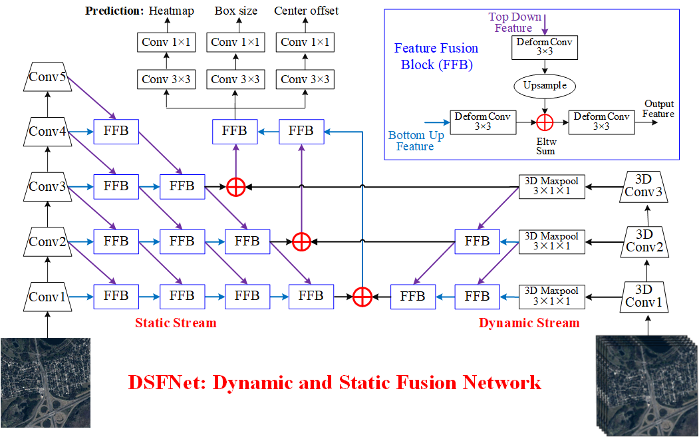

# DSFNet: Dynamic and Static Fusion Network for Moving Object Detection in Satellite Videos


## Algorithm Introduction

DSFNet: Dynamic and Static Fusion Network for Moving Object Detection in Satellite Videos, Chao Xiao, Qian Yin, and Xingyi Ying.

We propose a two-stream network named DSFNet to combine the static context information and the dynamic motion cues to detect small moving object in satellite videos. Experiments on videos collected from Jilin-1 satellite and the results have demonstrated the effectiveness and robustness of the proposed DSFNet. For more detailed information, please refer to the paper.

In this code, we also apply [SORT](https://github.com/abewley/sort) to get the tracking results of DSFNet.

## Citation
If you find the code useful, please consider citing our paper using the following BibTeX entry.
```
@article{xiao2021dsfnet,
  title={DSFNet: Dynamic and Static Fusion Network for Moving Object Detection in Satellite Videos},
  author={Xiao, Chao and Yin, Qian and Ying, Xinyi and Li, Ruojing and Wu, Shuanglin and Li, Miao and Liu, Li and An, Wei and Chen, Zhijie},
  journal={IEEE Geoscience and Remote Sensing Letters},
  volume={19},
  pages={1--5},
  year={2021},
  publisher={IEEE}
}
```

## Prerequisite
* Tested on Ubuntu 20.04, with Python 3.7, PyTorch 1.7, Torchvision 0.8.1, CUDA 10.2, and 2x NVIDIA 2080Ti.
* You can follow [CenterNet](https://github.com/xingyizhou/CenterNet) to build the conda environment but remember to replace the DCNv2 used here with the used [DCNv2](https://github.com/CharlesShang/DCNv2/tree/pytorch_0.4) by CenterNet (Because we used the latested version of [DCNv2](https://github.com/CharlesShang/DCNv2) under PyTorch 1.7).
* You can also follow [CenterNet](https://github.com/xingyizhou/CenterNet) to build the conda environment with Python 3.7, PyTorch 1.7, Torchvision 0.8.1 and run this code.
* The dataset used here is available in [[BaiduYun](https://pan.baidu.com/s/1QuLXsZEUkZMoQ9JJW6Qz4w?pwd=4afk)](Sharing code: 4afk). You can download the dataset and put it to the data folder.
## Usage

#### On Ubuntu:
#### 1. Train.
```bash
python train.py --model_name DSFNet --gpus 0,1 --lr 1.25e-4 --lr_step 30,45 --num_epochs 55 --batch_size 4 --val_intervals 5  --test_large_size True --datasetname rsdata --data_dir  ./data/RsCarData/
```

#### 2. Test.
```bash
python test.py --model_name DSFNet --gpus 0 --load_model ./checkpoints/DSFNet.pth --test_large_size True --datasetname rsdata --data_dir  ./data/RsCarData/ 
```

#### (Optional 1) Test and visulization.
```bash
python test.py --model_name DSFNet --gpus 0 --load_model ./checkpoints/DSFNet.pth --test_large_size True --show_results True --datasetname rsdata --data_dir  ./data/RsCarData/ 
```

#### (Optional 2) Test and visualize the tracking results of SORT.
```bash
python testTrackingSort.py --model_name DSFNet --gpus 0 --load_model ./checkpoints/DSFNet.pth --test_large_size True --save_track_results True --datasetname rsdata --data_dir  ./data/RsCarData/ 
```

## Results and Trained Models

#### Qualitative Results


#### Quantative Results 

Quantitative results of different models evaluated by AP@50. The model weights are available at [[BaiduYun](https://pan.baidu.com/s/1-LAEW1v8c3VDsc-e0vstcw?pwd=bidt)](Sharing code: bidt). You can down load the model weights and put it to the checkpoints folder.

|  Models     |  AP@50 |
|--------------|-----------|
| DSFNet with Static    |     54.3     |
| DSFNet with Dynamic   |     60.5     |
| DSFNet                |     70.5     |

*This code is highly borrowed from [CenterNet](https://github.com/xingyizhou/CenterNet). Thanks to Xingyi zhou.

*The overall repository style is highly borrowed from [DNANet](https://github.com/YeRen123455/Infrared-Small-Target-Detection). Thanks to Boyang Li.

*The dataset is part of [VISO](https://github.com/The-Learning-And-Vision-Atelier-LAVA/VISO). Thanks to Qian Yin.
## Referrences
1. X. Zhou, D. Wang, and P. Krahenbuhl, "Objects as points," arXiv preprint arXiv:1904.07850, 2019.
2. K. Simonyan and A. Zisserman, "Two-stream convolutional networks for action recognition in videos," Advances in NeurIPS, vol. 1, 2014.
3. Bewley, Alex, et al. "Simple online and realtime tracking." 2016 IEEE international conference on image processing (ICIP). IEEE, 2016.
4. Yin, Qian, et al., "Detecting and Tracking Small and Dense Moving Objects in Satellite Videos: A Benchmark," IEEE Transactions on Geoscience and Remote Sensing (2021).
## Update
The eval code has been updated and can be found in './lib/utils/utils_eval.py'. The evaluation results can be generated by running testSaveMat.py first and then evaluation.py.
